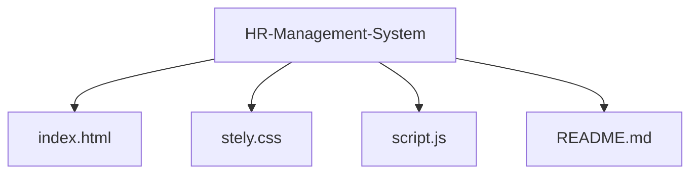

## HR Management System

A simple HR Management System built with **HTML**, **CSS**, and **JavaScript.**
This project provides basic features for managing employees, tracking attendance, handling payroll, and exporting employee information in a Word document format.

## Features

- Employee Information Management – Add and manage employees.

- Attendance Tracking – Basic time and attendance section.

- Payroll Section – Manage salary details.

- Employee Management – Add employees dynamically with JavaScript.

- Export to Word – Download employee information in a Word document format.

- Responsive Design – Works on desktop and mobile.

## Tech Stack

- HTML5 – Structure

- CSS3 – Styling (custom responsive design)

- JavaScript (ES6) – Functionality

## Getting Started

**Clone the Repository**

- git clone https://github.com/your-username/hr-management-system.git
- 
- cd hr-management-system

**Open in Browser**

-Just open index.html in any modern browser (Chrome, Edge, Firefox).

## Usage

- **Homepage** – Displays a hero section with system introduction.

- **Employee Section** – Add employee names using the input field.

- **Download Info** – Export employee data into a Word file.

- **Navigation Bar** – Switch between sections like Employee Info, Payroll, Attendance.

## Future Enhancements

- Database integration (MySQL / Firebase).

- Authentication system for HR login.

Advanced payroll calculation.

Detailed attendance reports.

👨‍💻 Author

Developed by Gourav Mehar ✨
